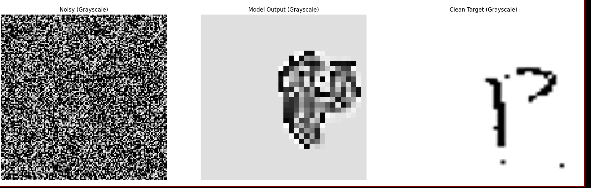
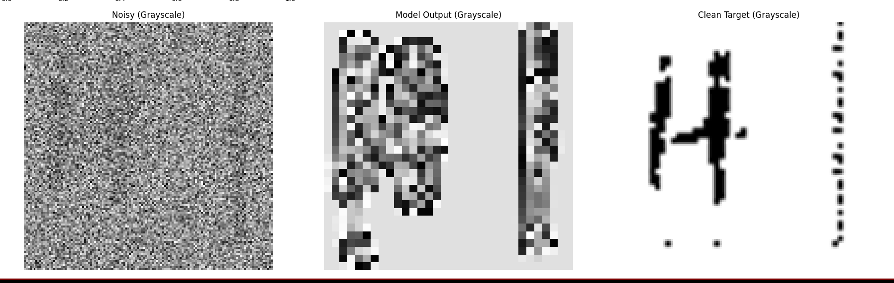

An attempt to do ink detection on virtually unwrapped segments of ancient greek scrolls. It uses a custom attention-based hybird segmentation and classifcation arcitecture trained on synthetic data.

This methodology has seen significant success on modern greek sample data. The team is currently working to rework the data generation process to more closly mimic the predicted appearance of letters within the scrolls.

Here are some samples of what it is capable of:

To train:
1. Open greek_letters/src/main.py and set the desginered parameters for data generation.
2. Set the desired paramaters in letter_visualization_model/settings.py
3. Run letter_visualization_model/setup.zsh

If you have any questions, feel free to leave an issue.
