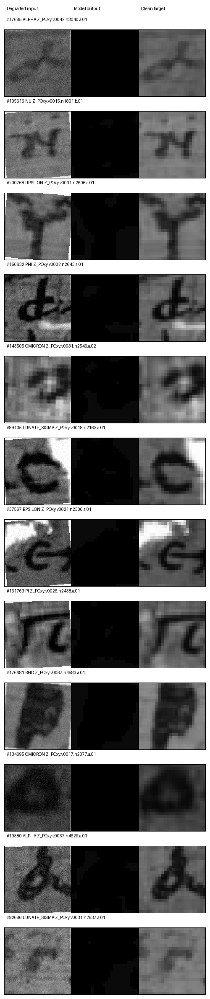
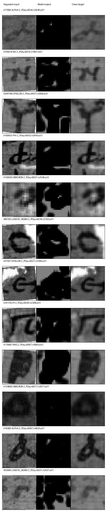

Ves is an attempt to do ink detection on virtually unwrapped segments of ancient greek scrolls. It uses a custom attention-based hybird segmentation and classifcation arcitecture trained on synthetic data.

This methodology has seen significant success on modern greek sample data. The team is currently working to rework the data generation process to more closly mimic the predicted appearance of letters within the scrolls.

Here are some samples of what it is capable of:




To Install Dependencies:
1. ```pip install -r requirements.txt```

To Generate Data:
1. Set desired data parameters in data_gen/papyrus/gen_data.py (optional)
2. Make sure you are in the root of this repo (important)
3. run ```python data_gen/papyrus/gen_data.py``` (this step can take quite a while)

To train:
1. Make sure you have generated the data (see above). You can check if it is
   generated by running ls. It should look something like this:
   ```
    % ls
    archive  data  data_gen  model  README.md  requirements.txt  samples
   ```
1. ```cd model/```
2. Set the desired parameters in settings.py (optional)
3. Run the setup script ```./setup.zsh```
4. While it is running, you may view the loss chart in your browser at localhost:6006/
5. When the model is finished, it will display results

The model will save the .pth to the specified location (default new.pth).

The script will automatically start logging to the specified log directory (default logs/).

To view the logs of a previous run:
1. ```python -m tensorboard.main --logdir ./logs --port=6006```
2. Navigate to localhost:6006 in your browser.

To run inference visualizer on a saved model using the preset data:
1. ```python letter_visualization_model/visualize_model.py example.pth```
2. Arrow keys navigate between samples, 'q' exits


To run inference visualizer on a saved model using your own sample:
1. cp your saved model to ``` model/model.pth```
2. ```cd model/usage/```
3. ```python run_model.py path_to_your_input_image.png```
4. Controls are the same as above

Note: the model has only been tested on Linux. If there is interest in windows/OSX support, add an issue or contact on discord.

If you have any questions, feel free to leave an issue or reach out on discord.
